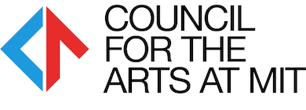

# Workshop

## About

This workshop has been written and designed by Aarón Montoya-Moraga in 2021, as a research assistant and master's student at MIT Media Lab's Opera of the Future and Future Sketches research groups. Additional code, examples, and documentation by MIT undergraduate researchers Peter Tone and Maxwell Wang.

## Key concepts

Machine learning, media arts, Arduino microcontroller, tiny machine learning.

## Code of conduct

* [Berlin Code of Conduct](https://berlincodeofconduct.org/)
* [p5.sj community statement](https://p5js.org/community/)

## Materials

You would need to bring a computer, with Linux, Mac or Windows operating systems.

This workshop is taught online over teleconferencing.

## Session 0

Basic facts:
* 2 hours

2 hours, Friday

input: color
output: buzzer

### Time budget

* 10min: Introductions of participants
* 10min: Installation of Arduino IDE and libraries
* 10min: Test the hardware microcontroller, hello_none
* Open script for 
* Capture examples of gesture and train overnight
* Capture examples of speech and train overnight

## Session 1

### Time budget

2 hours, Saturday

input: gesture, speech
output: buzzer, servo, LED

## Funding

Funded by the Council for the Arts at MIT, including 

## Contact

Email velouria@media.mit.edu or submit an issue at the repository https://github.com/montoyamoraga/tiny-trainable-instruments/
